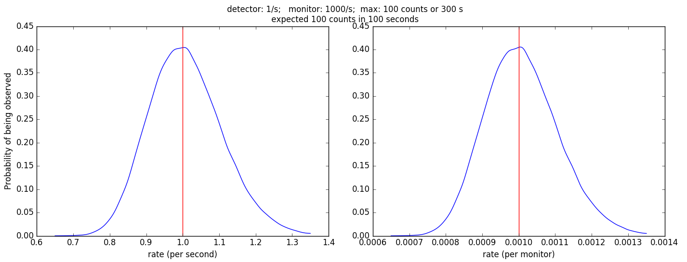
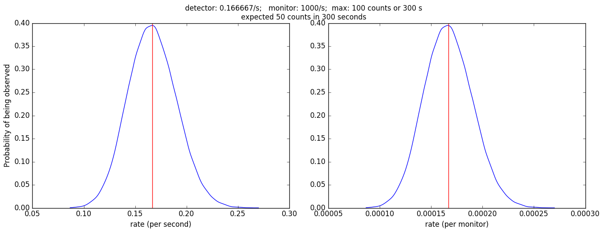
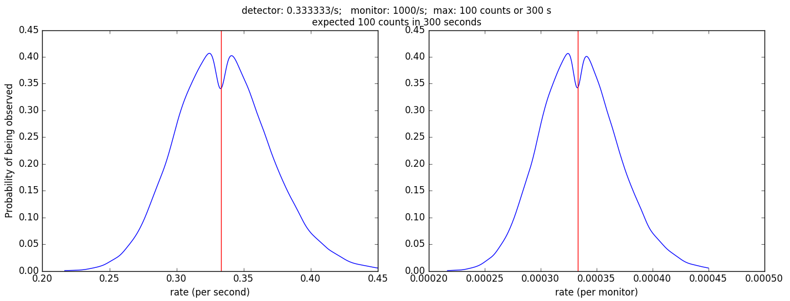
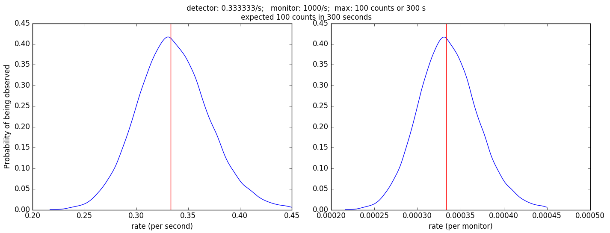
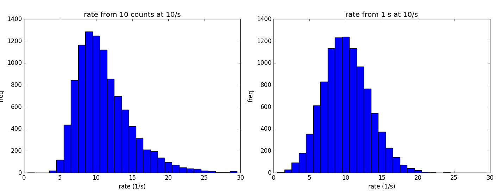

Count by Region of Interest
===========================

A bit of a surprise,  you have to be careful when interpreting data
with both time and ROI cutoff as stopping conditions.

I ran some simulations where the detector rate favoured count limited
measurements, time limited measurements, and time-and-count
limited measurements  (see attached).

The first two figures are the easy cases where you are neither
count nor time limited.  The double peak in the third figure
for time-and-count limited measuremenst is reproducible, and
is not an artifact of binning or small n or anything else.

You can compensate for this by shifting the rate peak slightly for the count
by time case by adding 0.5 to the estimated counts for the interval.

This issue is that the distribution of rates estimated from counts
by time vs counts by ROI are different, and they lead to problems
at the crossover, where some counts are limited by rate and others
are limited by time.  You can see an exaggerated example of this
in the final figure, where it is clear that the shape is different
and the peak is shifted.

Is this hack good enough, or do we need an analytical justification
for the choice of 0.5?

Note that we may want to increase are monitor counts by 0.5 before
normalizing the detector counts when counting by monitor.

Code used to produce the plots::

    n = 100
    cycles = 100000
    # expected count cutoff
    count_by_roi.simulate(cutoff_counts=n, cycles=cycles, detector_rate=n/100.)
    # expected time cutoff
    count_by_roi.simulate(cutoff_counts=n, cycles=cycles, detector_rate=n/600.)
    # count or time cutoff
    count_by_roi.simulate(cutoff_counts=n, cycles=cycles, detector_rate=n/300.)
    # count or time cutoff with correction
    count_by_roi.simulate(cutoff_counts=n, cycles=cycles, detector_rate=n/300., correction=0.5)

Code showing observed rate distribution when counting a given rate
by time and by count::

    subplot(121)
    plt.hist(10./np.sum(np.random.exponential(0.1, size=(10,10000)), axis=0), bins=arange(0.5,30.5,1.))
    title("rate from 10 counts at 10/s"); ylabel("freq"); xlabel("rate (1/s)")
    subplot(122)
    plt.hist(np.random.poisson(10, size=10000), bins=arange(0.5,30.5,1.))
    title("rate from 1 s at 10/s"); ylabel("freq"); xlabel("rate (1/s)")

    # And maybe overplot the "corrected" rate distribution
    subplot(121)
    plt.hist(10.5/np.sum(np.random.exponential(0.1, size=(10,10000)), axis=0), bins=arange(0.5,30.5,1.))

This is not quite the correct problem.  We are showing the probability of
observed rate given a fixed true rate.  Rather than plotting observed rates
for a give true rate, we should be plotting the true rate for given observed
rate.  This is a little harder to do, and is a project for another day.

Manifest
========

count_by_roi.py

    Program used to run the simulations

count_limited.png, time_limited.png, time_or_count_limited.png

    Results from running code without correction in the three conditions

time_or_count_with_correction.png

    Results from running code with correction

time_vs_count_rates.png

    Comparison of probability of individual count rates being observed
    for a true count rate of 10/s.